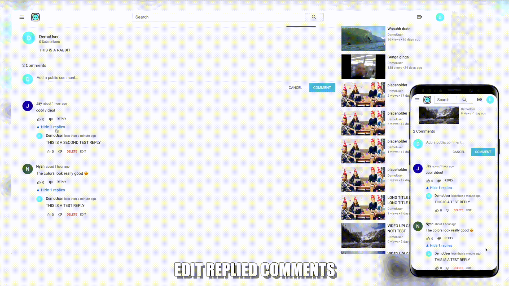

<!-- markdownlint-disable-file MD033 -->

<h1 align="center"> TumblyTube </h1> <br>
<p align="center">
    <a href="https://tumblytube.herokuapp.com/">
        
    </a>
</p>

<p align="center" > Inspired by YouTube </p>
<p align="center" > <a href="https://tumblytube.herokuapp.com/"> :rocket: LINK TO LIVE SITE </a></p>

## Table of Contents

1. [Overview](#overview)
    - [Technologies](#technologies)
    - [Libraries & Methodologies](#libraries--methodologies)
2. [Features](#features)
3. [Technical Implementation Details](#technical-implementation-details)
    - [Polymorphic Associations](#polymorphic-associations)
    - [Toast Notifications](#toast-notifications)
4. [Sources](#sources)
5. [TODOs / Features to implement](#todos--features-to-implement)
6. [Author Info](#author-info)


## Overview

TumblyTube is a full stack clone of YouTube, while highlightingits key features. This application allows users to connect with people around the world as they like, comment, share videos, and subscribe to others.

### Technologies

- React
- Redux
- Ruby
- Rails
- Postgresql
- AWS

### Libraries & Methodologies

- [Ajax](https://api.jquery.com/jQuery.ajax/) for sending and requesting data asynchronously
- [BCrypt](https://github.com/bcrypt-ruby/bcrypt-ruby) for user authentication
- [Material-ui icons](https://github.com/mui-org/material-ui/blob/master/docs/src/pages/components/material-icons/material-icons.md) for app-wide icons


## Features



- *USER AUTH*
  - Login, Create Account
  - or browse as guest / demo-user

- *VIDEOS*
  - Watch videos shared by other users
  - Upload, Edit, Delete your videos
  - View your liked videos

- *COMMENTS*
  - Leave comments on videos
  - Reply to comments
  - Edit, Delete your own comments


- *SUBSCRIPTIONS*
  - Subscribe to channels
  - View videos from subscribed channels

- *SEARCH*
  - Search for channles by name
  - Search for videos by title

- *LIKES / DISLIKES*
  - Like / Dislike videos
  - Like / Dislike vomments


### Check out additional features:

- *INFINITE SCROLL*
- *ERRORS*
- *CUSTOM HTML5 VIDEO PLAYER*
- *REQUIRE LOGIN DROP DOWNS*

    ***demonstrated under videos titled "FEATURE:" on [TumblyTube :arrow_upper_right:](https://tumblytube.herokuapp.com/#/results?search_query=FEATURE)***


[Back To The Top :arrow_up_small:](#table-of-contents)

## Technical Implementation Details

### Polymorphic Associations

After I completed building the comments feature, I was going to create a seperate Like model for comments since I already had an existing Like model for videos. However, I knew this wasn't ***DRY***.<br> 
Polymorphic associations became the perfect solution to my problem.

```RUBY
# app/models/like.rb
class Like < ApplicationRecord
  validates :liker_id, uniqueness: { scope: [:likeable_id, :likeable_type] }
  validates :version, inclusion: { in: %w(like dislike), 
    message: "%{value} is not a valid version, must be like or dislike"}

  belongs_to :likeable, polymorphic: true
  
  belongs_to :user,
    foreign_key: :liker_id,
    class_name: :User
end

# app/models/user.rb
class User < ApplicationRecord
  has_many :likes,
    foreign_key: :liker_id,
    class_name: :Like,
    dependent: :destroy

  has_many :liked_videos,
    through: :likes,
    source: :likeable,
    source_type: :Video
end
```

The Like model is associated not only with the Like button, but also with the Dislike button through the `version` column.
User`liker_id` is limited to one like/dislike on the same comment or video by validating uniqueness of the `likeable_id` and `likeable_type` in Like.

```RUBY
# app/models/comment.rb
class Comment < ApplicationRecord
  has_many :likes, as: :likeable, dependent: :destroy
end

# app/models/video.rb
class Video < ApplicationRecord
  has_many :likes, as: :likeable, dependent: :destroy
end
```

Instances of Like now belong to either Video or Comment on a single association as `likeable`.

[Back To The Top :arrow_up_small:](#table-of-contents)


### Toast Notifications

I wanted the Notification component to sit on top of the entire application rather than inside of the application to avoid render issues such as `overflow: hidden` `z-index`.

```html
<body>
    <!-- Notifications need to go here --> 
    <main id="root">
        <!-- Application gets rendered here --> 
    </main>
</body>
```

`React.createPortal()` in conjunction with `document.createElement()` allow me to do just that.

```javascript
// components/noti_portal/noti_portal.jsx
const [loaded, setLoaded] = useState(false);
const [portalId] = useState(`noti-portal-${uuid()}`);

useEffect(() => {
  const div = document.createElement("div");
  div.id = portalId;
  div.style = "position: fixed; bottom: 20px; left: 30px; z-index: 300";
    
  document.getElementsByTagName("body")[0].prepend(div);
  setLoaded(true);

  return () => document.getElementsByTagName("body")[0].removeChild(div);
}, [portalId]);

return (
  loaded && createPortal(
    <div className='noti'>
      {notis.map((noti) => (
        <Noti
          key={noti.id}
          mode={noti.mode}
          message={noti.message}
          onClose={() => removeNoti(noti.id)}
        />
      ))}
    </div>,
      
  document.getElementById(portalId)
)
```

A new dom element is created with `document.createElement("div")`. It gets injected as a first child of `<body>` with an unique ID.
The Notification component is then rendered inside the newly created `<div>` sitting on top of the application with the magic of `React Portals`. <br>

Now I needed to call `addNotis()` function inside of the Notifications component from the Root component to be able to provide the function to other components in the App using `React Context`.
This is when `React.forwardRef()` and `React.useImperativeHandle()` come in to make the functions inside the child component accessible from a parent component.

```javascript
// components/root.jsx
import { NotiContext } from "../context/noti_context"

const Root = ({ store }) => {
  const notiRef = useRef(null);

  const addNoti = ({ mode, message }) => {
    notiRef.current.addMessage({ mode, message });
  };
  
  return (
    <>
      <NotiContext.Provider value={{ addNoti }}>
        <App />
      </NotiContext.Provider>
      <NotiPortal ref={notiRef} autoClose={true} />
    </>
  );
}

// components/noti_portal/noti_portal.jsx
const NotiPortal = forwardRef((props, ref) => {
  const [notis, setNotis] = useState([]); // contains message and color(mode)
  
  useImperativeHandle(ref, () => ({
    addMessage(noti) {
      setNotis([{ ...noti, id: uuid() }, ...notis]);  // takes in message and mode; generates unique id
    },
  }));
    
  return (
    // create portal...
    // render Notifications
  )
});
```
The combination of `ref` `forwardRef` and `useImperativeHandle` allows the Root component to get access to `addNotis()` function inside the Notifications components whenever it gets rendered.


[Back To The Top :arrow_up_small:](#table-of-contents)

## Sources

- https://stackoverflow.com/a/25821830
  padStart fix for hex code length issue when generating random colors.


[Back To The Top :arrow_up_small:](#table-of-contents)

## TODOs / Features to implement

- [ ] Fix video metadata not preloading on iOS devices
- [ ] Add light / dark mode


[Back To The Top :arrow_up_small:](#table-of-contents)

---

## Author Info

- Website - [Ryan Naing](www.RyanNaing.com)


[Back To The Top :arrow_up_small:](#table-of-contents)
